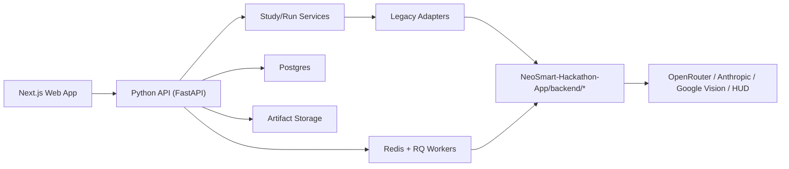

# Next.js + Python Migration Plan

Updated: 2026-03-28  
Workspace root: `SyntheticResponderLab`  
Reference app kept untouched: `SyntheticResponderLab/NeoSmart-Hackathon-App`

This revision replaces the 2026-03-26 plan with a fresh migration design based on the latest checked-out code. It accounts for:
- the expanded Product step
- Google Vision and URL-based product enrichment
- richer interview demo/synthesis flows
- interview analytics plus chat
- OpenRouter plus Anthropic provider routing in the qualitative branch

Constraint honored:
- `NeoSmart-Hackathon-App/` remains the untouched documentary/reference implementation
- all new implementation work should live elsewhere under `SyntheticResponderLab/`
- core Python grounding, simulation, analysis, and insight logic stays in Python

## 0. Executive Recommendation

Do not migrate by reproducing Streamlit pages inside Next.js.

Migrate by:
1. preserving the existing Python backend logic as the source of truth,
2. adding a new storage-agnostic Python API/service layer around it,
3. replacing Streamlit page orchestration with explicit APIs and jobs,
4. rebuilding the frontend as a premium one-page guided flow.

The strongest reusable assets in the current codebase are:
- `NeoSmart-Hackathon-App/backend/schemas.py`
- `NeoSmart-Hackathon-App/backend/survey/*`
- `NeoSmart-Hackathon-App/backend/grounding/*`
- `NeoSmart-Hackathon-App/backend/simulation/persona_generator.py`
- `NeoSmart-Hackathon-App/backend/simulation/run_manager.py`
- `NeoSmart-Hackathon-App/backend/simulation/llm_client.py`
- `NeoSmart-Hackathon-App/backend/analysis/*`
- `NeoSmart-Hackathon-App/backend/simulation/interview_*`
- `NeoSmart-Hackathon-App/backend/vision.py`
- `NeoSmart-Hackathon-App/backend/scraper.py`

The biggest blockers are still orchestration and state boundaries, not the simulation algorithms:
- `NeoSmart-Hackathon-App/backend/storage.py`
- `NeoSmart-Hackathon-App/backend/workflow.py`
- `NeoSmart-Hackathon-App/backend/analysis/question_stats.py`
- `NeoSmart-Hackathon-App/app/pages/2_business_product_context.py`
- `NeoSmart-Hackathon-App/app/pages/6_run_simulation.py`
- `NeoSmart-Hackathon-App/app/pages/9_interview_synthesis.py`
- `NeoSmart-Hackathon-App/app/pages/11_interview_insights.py`

## 1. Target Architecture

### 1.1 Recommended architecture

Use a three-part product architecture:

- `Next.js frontend`
  - premium one-page guided experience
  - sticky top progress nav
  - reveal-on-scroll sections
  - local UX state only

- `Python API/backend`
  - FastAPI is the recommended fit
  - Pydantic aligns naturally with the existing `backend/schemas.py`
  - wraps the existing Python logic through adapters and services
  - owns validation, enrichment, grounding, simulation, analysis, insights, and qualitative flows

- `Persistence + jobs`
  - Postgres for study state, runs, jobs, transcripts, and metadata
  - filesystem-backed artifact storage first, with an abstraction for S3 later
  - Redis + RQ for background jobs and inspectable progress

Why this stack fits the current codebase:
- existing contracts are already Python/Pydantic-oriented
- background work is required for simulation and interview generation
- inspectability matters, so simpler infrastructure is better than an overly abstract event system

### 1.2 High-level request flow



### 1.3 Source-of-truth boundary

Python remains the source of truth for:
- study validation
- survey parsing and normalization
- geography and prior logic
- persona generation
- response generation
- fallback behavior
- trust, realism, benchmark, and stability calculations
- product enrichment
- qualitative transcript generation and transcript-grounded chat context

Next.js should only own:
- visual presentation
- interaction flow
- scroll progression
- unsaved local form state
- client-side filtering and chart presentation

### 1.4 Reuse strategy: unchanged vs adapted

Reuse unchanged or nearly unchanged first:
- `backend/schemas.py`
- `backend/survey/parser.py`
- `backend/survey/schema_normalizer.py`
- `backend/survey/validator.py`
- `backend/presets.py`
- `backend/grounding/prior_sampler.py`
- `backend/grounding/geography_context.py`
- `backend/grounding/geography_prior_filter.py`
- `backend/grounding/calibration.py`
- `backend/simulation/persona_generator.py`
- most of `backend/simulation/run_manager.py`
- `backend/simulation/prompt_builder.py`
- `backend/simulation/llm_client.py`
- `backend/simulation/interview_prompt_builder.py`
- `backend/simulation/interview_runner.py`
- `backend/simulation/interview_insights.py`
- `backend/analysis/benchmark.py`
- `backend/analysis/findings.py`
- `backend/analysis/realism.py`
- `backend/analysis/stability.py`
- `backend/scraper.py`
- most of `backend/vision.py`

Wrap or refactor before exposure:
- `backend/storage.py`
- `backend/workflow.py`
- `backend/analysis/question_stats.py`
- orchestration inside `app/pages/2_business_product_context.py`
- orchestration inside `app/pages/6_run_simulation.py`
- orchestration inside `app/pages/9_interview_synthesis.py`
- page-local analytics/chat state inside `app/pages/11_interview_insights.py`
- `backend/fixtures.py` if demo loading is kept

## 2. Proposed Repo Structure

Keep the reference app untouched and add the productized stack in parallel at the root of `SyntheticResponderLab/`.

```text
SyntheticResponderLab/
├── Documentation/
│   ├── frontend_migration_first_pass_2026-03-26.md
│   └── nextjs_python_migration_plan_2026-03-26.md
├── NeoSmart-Hackathon-App/                  # untouched reference implementation
├── apps/
│   ├── api/
│   │   ├── app/
│   │   ├── src/
│   │   │   ├── adapters/
│   │   │   │   └── legacy_backend/
│   │   │   ├── services/
│   │   │   ├── jobs/
│   │   │   ├── persistence/
│   │   │   ├── api/
│   │   │   ├── schemas/
│   │   │   └── config/
│   │   ├── tests/
│   │   ├── pyproject.toml
│   │   └── README.md
│   └── web/
│       ├── app/
│       ├── components/
│       ├── features/
│       ├── hooks/
│       ├── lib/
│       ├── styles/
│       ├── public/
│       ├── package.json
│       └── next.config.ts
├── packages/
│   ├── ui/
│   ├── config/
│   └── types/
├── infra/
│   ├── docker/
│   └── compose/
└── runtime/
    └── artifacts/
```

### 2.1 Why this structure

- keeps `NeoSmart-Hackathon-App/` frozen as the documentary reference
- avoids mixing new product code into the hackathon app
- gives the new backend a clean place to add persistence, adapters, and jobs
- gives the new frontend a clean product shell without Streamlit assumptions

### 2.2 API project organization

Recommended internal layout for `apps/api/src/`:

- `adapters/legacy_backend/`
  - thin wrappers around reusable modules in `NeoSmart-Hackathon-App/backend/*`
  - no Streamlit dependencies

- `services/`
  - study, product, survey, persona, run, analysis, trust, interview, research-brief services

- `jobs/`
  - run simulation job
  - interview generation job
  - optional stability rerun job

- `persistence/`
  - models, repositories, file storage, job state

- `api/`
  - routers, dependency wiring, health endpoints

- `schemas/`
  - API request/response models
  - these should mirror or compose the legacy Pydantic models

## 3. Backend API Endpoints

The API should expose business capabilities, not page-shaped endpoints.

### 3.1 Studies and workflow

| Endpoint | Purpose | Backing code |
|---|---|---|
| `POST /api/v1/studies` | Create a new study draft | new service |
| `GET /api/v1/studies/{study_id}` | Load full canonical study state | new service |
| `PATCH /api/v1/studies/{study_id}/study-mode` | Save `neo_smart` or `general` | wraps current study mode behavior |
| `PATCH /api/v1/studies/{study_id}/audience` | Save `AudienceFilter` | `backend/schemas.py` |
| `PATCH /api/v1/studies/{study_id}/product` | Save `BusinessProductContext` | `backend/schemas.py` |
| `PATCH /api/v1/studies/{study_id}/market` | Save `MarketContext` | `backend/schemas.py` |
| `PATCH /api/v1/studies/{study_id}/experiment` | Save `ExperimentPlan` | `backend/schemas.py` |
| `PATCH /api/v1/studies/{study_id}/research-brief` | Save `ResearchBrief` | `backend/schemas.py` |
| `GET /api/v1/studies/{study_id}/workflow` | Return readiness and missing prerequisites | replaces `backend/workflow.py` |

### 3.2 Presets and capabilities

| Endpoint | Purpose | Backing code |
|---|---|---|
| `GET /api/v1/presets/neo-smart` | Neo audience/product/market defaults | `backend/presets.py` |
| `GET /api/v1/presets/neo-smart/research-brief` | Neo research-brief defaults | `backend/presets.py` |
| `GET /api/v1/models/openrouter` | Available OpenRouter models | `backend/simulation/llm_client.py` |
| `GET /api/v1/capabilities/providers` | Report available LLM providers and enrichment capabilities | new service over env checks |
| `GET /api/v1/health` | Environment, dependency, and asset diagnostics | new service |

### 3.3 Product enrichment

These endpoints are now first-class because the Product step already includes real enrichment logic.

| Endpoint | Purpose | Backing code |
|---|---|---|
| `POST /api/v1/studies/{study_id}/product/url-autofill` | Scrape a product page and generate structured product context | `backend/scraper.py`, `backend/vision.py::generate_full_context_from_url` |
| `POST /api/v1/studies/{study_id}/product/image-analysis` | Upload image, run Vision analysis, return labels/objects/colors | `backend/vision.py::extract_full_analysis` |
| `POST /api/v1/studies/{study_id}/product/image-context` | Generate full product context from uploaded image analysis | `backend/vision.py::generate_full_context_from_image` |
| `GET /api/v1/studies/{study_id}/product` | Return saved product context including visual fields | persisted study state |

Design note:
- `image-analysis` can be synchronous in the first implementation
- `image-context` can also be synchronous initially because it is a short enrichment step, not a long-running simulation

### 3.4 Survey endpoints

| Endpoint | Purpose | Backing code |
|---|---|---|
| `POST /api/v1/studies/{study_id}/survey/upload` | Upload, parse, normalize, and validate survey file | `backend/survey/*` |
| `GET /api/v1/studies/{study_id}/survey` | Return normalized schema, warnings, and file metadata | persisted study state |
| `PATCH /api/v1/studies/{study_id}/survey` | Optional manual schema correction later | new service |

### 3.5 Grounding and persona endpoints

| Endpoint | Purpose | Backing code |
|---|---|---|
| `POST /api/v1/studies/{study_id}/geography/resolve` | Resolve geography context from ZIP | `backend/grounding/geography_context.py` |
| `GET /api/v1/studies/{study_id}/grounding/status` | Return prior availability, geography notes, affordability notes | new service over grounding modules |
| `POST /api/v1/studies/{study_id}/personas/preview` | Preview personas before a full run | `backend/simulation/persona_generator.py` |
| `GET /api/v1/studies/{study_id}/personas` | Return latest saved personas | persistence + adapter |

### 3.6 Run and simulation endpoints

Treat simulation as a job, not a synchronous request.

| Endpoint | Purpose | Backing code |
|---|---|---|
| `POST /api/v1/studies/{study_id}/runs` | Create a run job from the current study state | wraps `app/pages/6_run_simulation.py` orchestration |
| `GET /api/v1/studies/{study_id}/runs` | List runs for a study | new service |
| `GET /api/v1/runs/{run_id}` | Run metadata and current status | persistence |
| `GET /api/v1/runs/{run_id}/progress` | Stage/progress payload for polling or SSE | job tracking |
| `GET /api/v1/runs/{run_id}/result` | Run summary and counts | persistence + adapter |
| `GET /api/v1/runs/{run_id}/records` | Response records | persistence |
| `GET /api/v1/runs/{run_id}/personas` | Personas used in the run | persistence |
| `POST /api/v1/runs/{run_id}/stability` | Start rerun/stability job | `backend/analysis/stability.py` |
| `GET /api/v1/runs/{run_id}/stability` | Return stability outputs | persistence + adapter |

### 3.7 Analysis, trust, and insights endpoints

| Endpoint | Purpose | Backing code |
|---|---|---|
| `GET /api/v1/runs/{run_id}/analysis/summary` | Top-level KPIs and distributions | service over `backend/analysis/*` |
| `GET /api/v1/runs/{run_id}/analysis/questions` | Question list and metadata | service over schema + records |
| `GET /api/v1/runs/{run_id}/analysis/questions/{question_id}` | Question detail and distributions | `backend/analysis/question_stats.py` after decoupling |
| `GET /api/v1/runs/{run_id}/analysis/benchmark` | Benchmark outputs | `backend/analysis/benchmark.py` |
| `GET /api/v1/runs/{run_id}/analysis/realism` | Realism outputs | `backend/analysis/realism.py` |
| `GET /api/v1/runs/{run_id}/analysis/calibration` | Calibration outputs | `backend/grounding/calibration.py` |
| `GET /api/v1/runs/{run_id}/insights` | Findings, recommendations, trust notes | `backend/analysis/findings.py` |

### 3.8 Interview and research-brief endpoints

| Endpoint | Purpose | Backing code |
|---|---|---|
| `GET /api/v1/studies/{study_id}/research-brief` | Load research brief | persistence |
| `PATCH /api/v1/studies/{study_id}/research-brief` | Save research brief | persistence |
| `POST /api/v1/studies/{study_id}/interviews` | Start interview generation job | `backend/simulation/interview_runner.py` |
| `GET /api/v1/studies/{study_id}/interviews` | List transcripts | persistence |
| `GET /api/v1/interviews/{interview_id}` | Transcript detail | persistence |
| `GET /api/v1/studies/{study_id}/interview-insights/overview` | Aggregated transcript overview | service extracted from `app/pages/11_interview_insights.py` |
| `GET /api/v1/studies/{study_id}/interview-insights/by-question` | Question-level transcript breakdowns | service extracted from `app/pages/11_interview_insights.py` |
| `GET /api/v1/studies/{study_id}/interview-insights/demographics` | Transcript demographic breakdowns | service extracted from `app/pages/11_interview_insights.py` |
| `POST /api/v1/studies/{study_id}/interview-insights/context` | Build transcript-grounded system prompt | `backend/simulation/interview_insights.py` |
| `POST /api/v1/studies/{study_id}/interview-insights/chat` | Submit chat message history and filters | `backend/simulation/interview_insights.py` |

Optional internal-only endpoint:
- `POST /api/v1/studies/{study_id}/interviews/demo-load`
  - only if demo transcript loading remains valuable for internal development
  - should not rely on the current hard-coded external CSV path

## 4. Next.js App Structure and Components

### 4.1 Route strategy

The experience is one main guided page, but the app should still have a small route structure:

- `/`
  - landing page
  - create/load study

- `/studies/[studyId]`
  - primary premium one-page workflow

- `/studies/[studyId]/runs/[runId]`
  - optional deep link into a completed run

### 4.2 Recommended app structure

```text
apps/web/
├── app/
│   ├── layout.tsx
│   ├── page.tsx
│   └── studies/
│       └── [studyId]/
│           ├── page.tsx
│           └── loading.tsx
├── components/
│   ├── nav/
│   │   ├── StickyProgressNav.tsx
│   │   └── StepPill.tsx
│   ├── layout/
│   │   ├── AppShell.tsx
│   │   ├── SectionFrame.tsx
│   │   └── RevealSection.tsx
│   ├── workflow/
│   │   ├── WorkflowPage.tsx
│   │   ├── SectionHeader.tsx
│   │   ├── NextStepCta.tsx
│   │   └── ReadinessBanner.tsx
│   ├── sections/
│   │   ├── MainSection.tsx
│   │   ├── StudyModeSection.tsx
│   │   ├── AudienceSection.tsx
│   │   ├── ProductSection.tsx
│   │   ├── MarketSection.tsx
│   │   ├── SurveySection.tsx
│   │   ├── PersonasSection.tsx
│   │   ├── ExperimentSection.tsx
│   │   ├── RunSection.tsx
│   │   ├── AnalysisSection.tsx
│   │   ├── InsightsSection.tsx
│   │   ├── TrustSection.tsx
│   │   └── InterviewExtensionSection.tsx
│   ├── product/
│   │   ├── ProductUrlAutofillPanel.tsx
│   │   ├── ProductImageUploadPanel.tsx
│   │   ├── ProductVisionSummary.tsx
│   │   └── ProductContextForm.tsx
│   ├── personas/
│   │   ├── PersonaPreviewGrid.tsx
│   │   └── GroundingStatusPanel.tsx
│   ├── runs/
│   │   ├── RunProgressPanel.tsx
│   │   └── SimulationSummary.tsx
│   ├── analysis/
│   │   ├── QuestionExplorer.tsx
│   │   ├── DistributionChart.tsx
│   │   └── OpenTextSamples.tsx
│   └── interviews/
│       ├── ResearchBriefEditor.tsx
│       ├── TranscriptOverviewTab.tsx
│       ├── TranscriptByQuestionTab.tsx
│       ├── TranscriptDemographicsTab.tsx
│       └── AskTheDataChatPanel.tsx
├── features/
│   ├── study/
│   ├── product/
│   ├── survey/
│   ├── personas/
│   ├── runs/
│   ├── analysis/
│   └── interviews/
├── hooks/
│   ├── useStudy.ts
│   ├── useWorkflowProgress.ts
│   ├── useRunProgress.ts
│   └── useInterviewChat.ts
└── lib/
    ├── api/
    ├── motion/
    └── validation/
```

### 4.3 One-page section order

Required section sequence:
- Main
- Study Mode
- Audience
- Product
- Market
- Survey
- Personas
- Experiment
- Run
- Analysis
- Insights
- Trust
- Interview Extension

### 4.4 Section-specific notes based on the real codebase

Main
- establish product story: grounded personas first, AI answers second, trust after

Study Mode
- keep `neo_smart` vs `general`

Audience
- map cleanly to `AudienceFilter`

Product
- must include:
  - manual fields
  - URL autofill
  - image upload
  - visual labels/objects/colors preview
- this is now a differentiated product step, not just another form

Market
- preserve market/competitor framing fields

Survey
- show parse/normalize warnings and a normalized schema preview

Personas
- make grounding visible before the run
- include geography/prior notes and persona preview

Experiment
- model selection, deterministic/live mode, run parameters

Run
- background job status and per-stage progress

Analysis
- question explorer and summary

Insights
- deterministic findings and recommendations

Trust
- realism, benchmark, calibration, and stability in a single product story

Interview Extension
- research brief
- transcript generation
- transcript analytics tabs
- ask-the-data chat

### 4.5 Premium UX direction

The new frontend should feel like a premium research product, not a dashboard clone.

Recommended interaction pattern:
- sticky top progress nav
- section reveal on scroll
- clear “continue” CTA between sections
- short narrative framing at the top of each section
- visible proof points at Personas, Run, Trust, and Insights
- keep debug/status messaging accessible for inspectability

## 5. Client/Backend State Ownership

### 5.1 Backend-owned canonical state

The backend must own:
- study mode
- audience
- business/product context
- market context
- normalized survey schema
- experiment plan
- geography context
- persona previews and saved personas
- run metadata
- simulation outputs and response records
- trust outputs
- research brief
- interview transcripts
- transcript analytics payloads
- product enrichment results

This replaces the current role of `backend/storage.py`.

### 5.2 Client-owned ephemeral state

The client should own only UI-local state:
- current section in view
- expand/collapse state
- unsaved field edits
- tab selection
- local chart filters
- animation state
- file picker state before upload

### 5.3 Hybrid state

Use staged sync for:
- long forms
- product enrichment flows
- research brief editing
- interview chat messages

Recommended pattern:
- client keeps in-progress edits locally
- save or autosave sends validated payloads to backend
- backend response becomes canonical state

For chat specifically:
- backend should own provider resolution and system-prompt construction
- client can own the transient visible conversation until persistence is explicitly needed

### 5.4 Workflow readiness ownership

Workflow readiness should be backend-derived.

Reason:
- current rules are encoded in `backend/workflow.py`
- the frontend should display readiness, not invent it

Recommended replacement:
- a storage-agnostic readiness service returning:
  - current stage status
  - unmet prerequisites
  - warnings
  - data-quality notes

## 6. File Upload and Job Execution Strategy

### 6.1 Asset storage strategy

Use API-managed artifact storage for uploaded files and generated outputs.

Recommended first implementation:
- store binary uploads and generated artifacts on local filesystem under `runtime/artifacts/`
- store metadata and references in Postgres
- keep the storage interface abstract so S3 can be added later without changing service contracts

### 6.2 Survey upload strategy

Survey upload should be synchronous in the first version.

Flow:
1. client uploads survey file
2. backend stores original asset
3. backend parses, normalizes, and validates immediately
4. backend stores normalized schema and warnings
5. client receives schema preview payload

Why:
- current parsing is fast enough for request/response
- the value of this step is immediate feedback

### 6.3 Product URL enrichment strategy

Product URL autofill should be synchronous initially, with a hard timeout and explicit error messaging.

Flow:
1. client submits URL
2. backend scrapes text through `backend/scraper.py`
3. backend generates structured context through `backend/vision.py::generate_full_context_from_url`
4. client previews and confirms before save

### 6.4 Product image analysis strategy

Product image analysis should be a two-step synchronous flow in phase one:
1. upload image asset
2. run Vision analysis and optionally generate structured context

Why synchronous first:
- faster to ship
- easier to debug
- user benefits from immediate preview of labels/objects/colors

When to make it async later:
- if images become large
- if provider latency becomes high
- if batch image workflows are introduced

### 6.5 Simulation execution strategy

Simulation must be a background job.

Flow:
1. client submits `POST /runs`
2. backend validates study readiness
3. backend creates run + job records
4. worker executes:
   - geography resolution if needed
   - persona generation
   - response generation
   - record persistence
   - summary/trust side computations as appropriate
5. client polls `/progress` or subscribes to SSE

Why:
- current run logic is slow, network-dependent, and stageful
- explicit jobs preserve inspectability and failure handling

### 6.6 Interview execution strategy

Interview generation should also be a background job.

Reason:
- it already performs repeated model calls in `backend/simulation/interview_runner.py`
- transcript volume scales with the number of personas and prompts

### 6.7 Progress model

At minimum, job progress should include:
- `queued`
- `running`
- `completed`
- `failed`

Simulation progress payload should also include:
- current stage
- respondents planned
- respondents completed
- live-call error counts
- fallback counts
- warnings

## 7. Phased Migration Plan

### Phase 0: Lock the contracts

Goal:
- capture canonical study state
- define API contracts
- formalize missing environment and data assumptions

Deliverables:
- updated architecture docs
- study schema map
- endpoint contract draft
- dependency/env audit

### Phase 1: Build the backend foundation

Goal:
- create the new API project without changing `NeoSmart-Hackathon-App`

Work:
- scaffold `apps/api`
- build persistence layer
- build legacy adapters
- replace `backend/storage.py` at the service boundary
- rewrite workflow readiness as a storage-agnostic service
- add health/capability diagnostics

### Phase 2: Ship the first product slice

Goal:
- deliver the first premium one-page setup flow

Work:
- scaffold `apps/web`
- build sticky top nav and section framework
- ship:
  - Main
  - Study Mode
  - Audience
  - Product
  - Market
  - Survey
  - Personas
- wire autosave and workflow readiness

### Phase 3: Add quant run and trust flow

Goal:
- replace the core setup -> run -> analysis flow

Work:
- Experiment section
- Run section
- progress tracking
- Analysis section
- Insights section
- Trust section

### Phase 4: Add qualitative extension

Goal:
- bring over the interview branch as a premium extension

Work:
- Research Brief editor
- interview generation jobs
- transcript list/detail
- interview analytics tabs
- ask-the-data chat

### Phase 5: Harden and make the new stack primary

Goal:
- operationalize the new product stack

Work:
- tests
- observability
- environment/bootstrap docs
- artifact cleanup rules
- decide whether Streamlit remains a debug/reference app only

## 8. First Thin Vertical Slice to Build

### Recommended slice

Build this first:
1. create/load study
2. choose study mode
3. save audience
4. save product
5. run product URL autofill
6. run product image analysis
7. save market
8. upload and parse survey
9. preview personas

In UI terms, that means:
- Main
- Study Mode
- Audience
- Product
- Market
- Survey
- Personas

### Why this slice is the right one now

It proves the most important migration assumptions without taking on the slowest runtime work first:
- study state is no longer tied to Streamlit
- product enrichment survives the migration
- survey parsing stays in Python
- grounding and persona preview can be surfaced in the new UX
- the frontend can already tell the product story before full simulation is added

### Thin-slice acceptance criteria

- study state persists outside Streamlit
- product URL autofill works end-to-end
- product image analysis returns and saves visual labels/objects/colors
- survey upload returns normalized schema + warnings
- persona preview uses real Python grounding code
- sticky nav and section progression work on desktop and mobile

## 9. Refactor Hotspots and Risks

### 9.1 Code hotspots that need deliberate treatment

| File / area | Risk | Recommended handling |
|---|---|---|
| `backend/storage.py` | hard dependency on `st.session_state` | replace entirely with persistence services |
| `backend/workflow.py` | readiness logic tied to storage helpers | preserve rules, rewrite implementation |
| `backend/analysis/question_stats.py` | loads records from storage instead of inputs | refactor to accept explicit records/run ids |
| `app/pages/2_business_product_context.py` | UI and service orchestration are mixed | extract enrichment logic into backend services |
| `app/pages/6_run_simulation.py` | page currently behaves like a backend orchestrator | split into services + jobs |
| `backend/simulation/run_manager.py` | monolithic but important | wrap first, refactor later |
| `backend/vision.py` | mixes provider auth, formatting, and LLM-based context generation | keep core logic, wrap carefully, isolate config/errors |
| `backend/fixtures.py` | depends on external prototype CSV path | keep demo-only or replace with managed demo assets |
| `app/pages/11_interview_insights.py` | mixes analytics shaping, provider routing, and chat state | move analytics shaping to services and keep rendering in web |

### 9.2 Environment and dependency risks

Observed in the current codebase:
- `requirements.txt` still does not list `pandas` even though it is widely imported
- `backend/vision.py` requires `cryptography` for service-account auth but `cryptography` is not listed
- `.env.example` includes `OPENROUTER_API_KEY`, `OPENROUTER_BASE_URL`, `GOOGLE_CLOUD_API_KEY`, `DATA_ROOT`, `RUNS_DIR`
- code also uses `ANTHROPIC_API_KEY`
- code also uses `HUD_API_TOKEN`
- not all of these are documented consistently

Recommended mitigation:
- create a new backend-specific environment contract
- expose a startup health endpoint that reports missing env vars, missing providers, and missing assets

### 9.3 Data and asset risks

Observed in the current workspace:
- `NeoSmart-Hackathon-App/data/` only exposes `data/processed/benchmarks/realism_targets_neo_smart_template.json`
- grounding priors and lookup assets are still external/generated expectations
- `backend/fixtures.py` expects `prototype/output/interview_transcripts.csv`, which is not present in this workspace

Recommended mitigation:
- treat asset presence as an explicit deployment concern
- do not hide missing artifacts behind silent fallbacks
- add health diagnostics and bootstrap docs early

### 9.4 Documentation drift risk

Observed in the current repo:
- `NeoSmart-Hackathon-App/README.md` is stale and still describes the project as more scaffold/TODO-heavy than the codebase now is

Recommended mitigation:
- do not use the README as the product truth source
- use code inspection and the new docs as the migration baseline

## 10. Recommended Next Implementation Step

Do this next, before writing product code:

1. freeze the canonical backend domain model for a `Study`
2. write the API contract for:
   - study state
   - workflow readiness
   - product URL autofill
   - product image analysis
   - survey upload
   - persona preview
3. define the persistence model for:
   - study drafts
   - uploaded assets
   - personas
   - runs
   - transcripts
   - job progress
4. confirm environment and artifact requirements for:
   - OpenRouter
   - Anthropic
   - Google Vision
   - HUD
   - grounding datasets

After that, the first implementation step should be:

`Scaffold apps/api and build a storage-agnostic backend boundary for study state, product enrichment, survey upload, and persona preview.`

That is the highest-leverage move because it:
- preserves the existing Python engine
- unlocks the premium one-page frontend
- captures the newly expanded Product step
- avoids rewriting simulation logic in JavaScript
